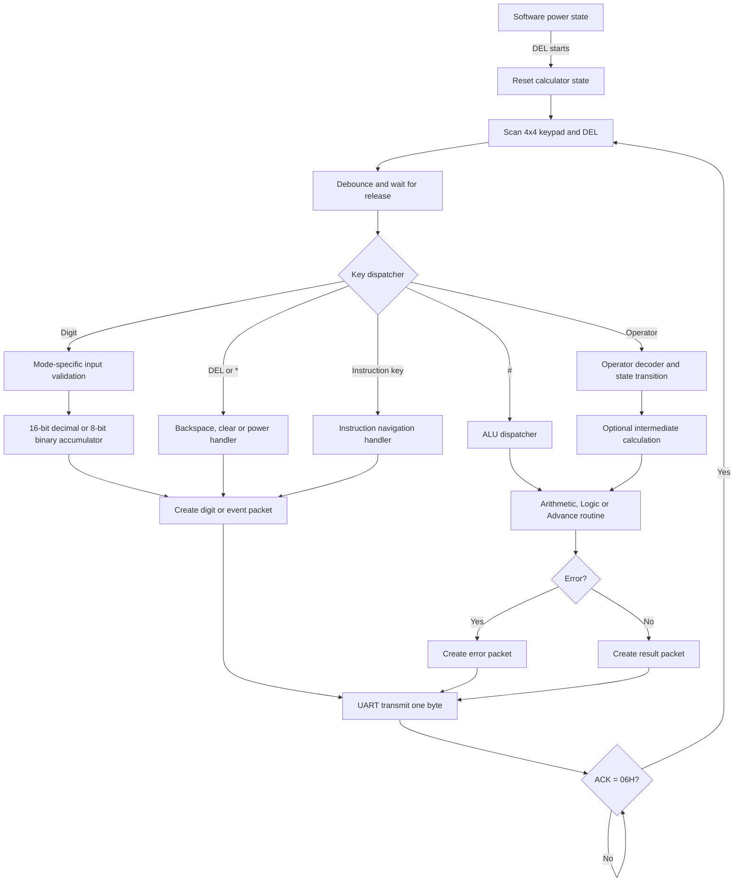
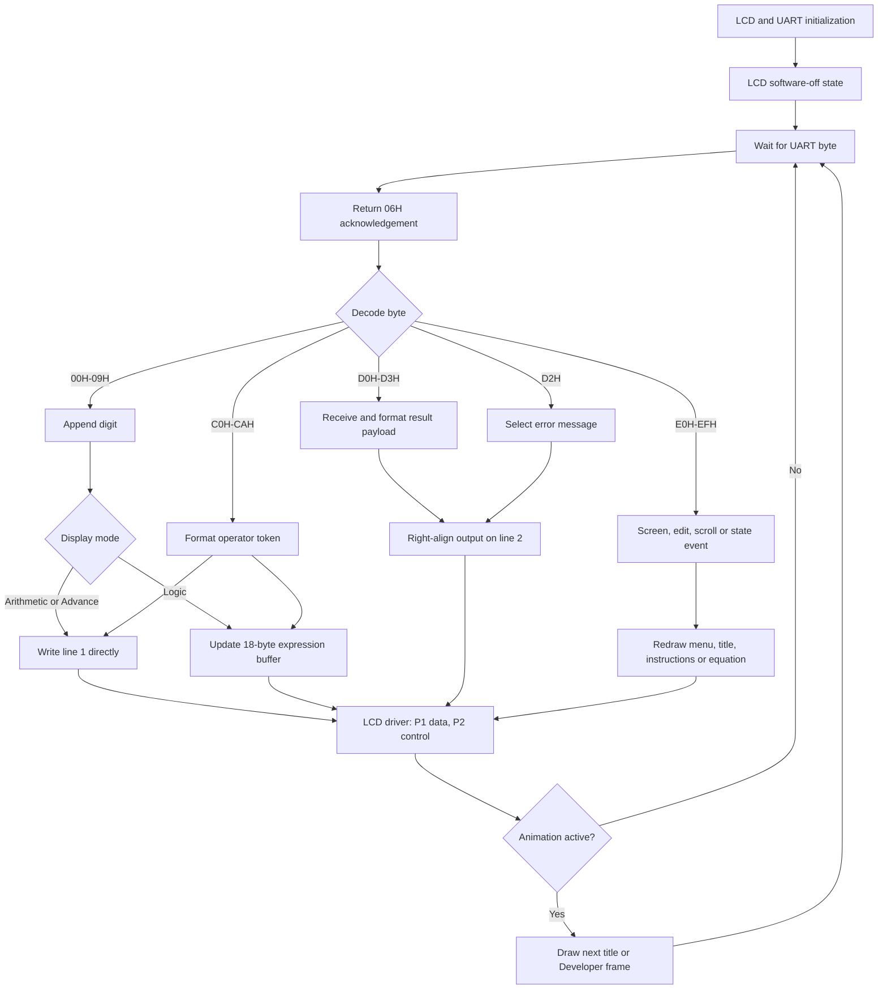
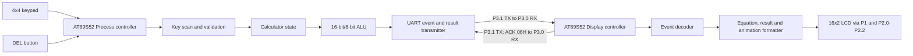

# Project 12 Calculator Functions and Block Diagrams

## 1. Project purpose

Project 12 is a two-controller AT89S52 calculator. The work is divided so that
one controller handles input and calculation while the other handles the LCD.

| Controller | Main responsibility | Firmware |
|---|---|---|
| Process controller | Keypad scanning, input validation, calculator state, ALU operations, error detection and UART transmission | `CALCULATE V9.hex` |
| Display controller | UART event decoding, equation formatting, result formatting, animation, instruction pages and 16x2 LCD control | `DISPLAY V9.hex` |

The controllers communicate through crossed UART lines. Every transmitted byte
must receive an `06H` acknowledgement before the Process controller continues.

## 2. Hardware allocation

### Process controller

| Connection | AT89S52 pins/port |
|---|---|
| Keypad rows | `P1.0` to `P1.3` |
| Keypad columns | `P1.4` to `P1.7` |
| DEL/backspace button | `P2.0`, active low |
| UART receive/ACK | `P3.0/RXD` |
| UART transmit/data | `P3.1/TXD` |

### Display controller

| Connection | AT89S52 pins/port |
|---|---|
| LCD data `D0-D7` | Port 1 |
| LCD `RS` | `P2.0` |
| LCD `RW` | `P2.1` |
| LCD `EN` | `P2.2` |
| UART receive/data | `P3.0/RXD` |
| UART transmit/ACK | `P3.1/TXD` |

## 3. Keypad layout and common keys

```text
1  2  3  A
4  5  6  B
7  8  9  C
*  0  #  D
```

| Key | General function |
|---|---|
| `0-9` | Operand entry; Logic mode accepts only `0` and `1` |
| `A-D` | Operator selected according to the active mode |
| `#` | Equals; after one clear, `#` returns to the mode menu |
| `*` | Clear current expression; inside instructions it exits to Advance mode |
| DEL | Power control in the mode menu; backspace in a mode; exits instructions |

The calculator starts in software power-off state. Press DEL once to start it.
The LCD shows `READY`, then the mode menu.

## 4. Mode summary

### Mode 1: Arithmetic

| Key | Symbol | Operation |
|---|---|---|
| `A` | `+` | Addition |
| `B` | `-` | Subtraction or leading negative sign |
| `C` | `*` | Multiplication |
| `D` | `/` | Integer division |

Arithmetic operands and results use unsigned 16-bit magnitudes, from `0` to
`65535`, plus a separate sign flag for a negative accumulated result.

Important Arithmetic behavior:

- Division displays quotient and remainder using `R`. Example: `1/2=0R1`.
- Before final `=`, a newly selected operator evaluates the pending operation.
  Example: entering `1+1+1` changes the equation to `2+1`.
- After final `=`, selecting an operator begins the next expression with
  `ANS`. Example: `2+2=4`, then `+1` displays `ANS+1`.
- Leading `+`, `*` and `/` remain visible but are ignored by the ALU. Therefore
  `*5+1=` remains visible as entered and produces `6`.
- A leading `-` is treated as a negative sign.
- Consecutive binary operators replace the previous operator.

### Mode 2: 8-bit Logic

| Key | Symbol | Operation |
|---|---|---|
| `A` | `&` | Bitwise AND |
| `B` | `|` | Bitwise OR |
| `C` | `^` | Bitwise XOR |
| `D` | `!` | Bitwise NOT/complement |

Logic behavior:

- Only `0` and `1` are accepted. Keys `2-9` are ignored.
- Each operand is limited to eight bits.
- Results are always displayed as eight binary digits on LCD line 2.
- The complete expression is stored in an 18-byte Display-controller buffer:
  eight bits, an operator, eight bits and `=`.
- If the expression exceeds 16 LCD cells, key `4` selects the left window and
  key `6` selects the right window.

### Mode 3: Advance

| Key | Displayed token | Operation |
|---|---|---|
| `A` | `^2` | Square the first operand |
| `B` | `^` | Raise the first operand to the second operand |
| `C` | `^0.5` | Integer square root |
| `D` | — | Open instruction pages |

The square-root result is the largest integer whose square does not exceed the
input. For example, the square root of `10` is `3`. The exponent-zero result is
`1`.

`^2` and `^0.5` are treated as complete display tokens. One DEL press removes
the entire token.

## 5. Result, clear and backspace behavior

- Equation input is shown on LCD line 1.
- Decimal, binary, remainder and error output is shown on LCD line 2.
- DEL removes the current digit, operator or unary token and updates both
  controllers' states.
- `ANS` is one three-character token. Deleting it removes all of `ANS` and
  returns the cursor to column 1.
- After `=` has been pressed, DEL behaves as Clear instead of editing the
  completed equation.
- Logic-mode backspace hides the LCD while rebuilding line 1, preventing stale
  Arithmetic characters from flashing.
- The first `*` clears the active expression. Pressing `#` immediately after
  the clear returns to the mode menu.

## 6. Error detection

| Error code | LCD message | Cause |
|---:|---|---|
| `01H` | `ERROR:OVERFLOW` | A 16-bit Arithmetic result exceeds `65535` |
| `03H` | `ERROR:DIV ZERO` | Division by zero |
| `04H` | `ERROR:INPUT SIZE` | Decimal input exceeds the 16-bit range |
| `08H` | `ERROR:MAX 8 BIT` | A Logic operand exceeds eight bits |
| Other | `ERROR` | Unknown error code |

For input-size and eight-bit-limit errors, the exceeding digit is sent to the
Display controller first, so the user can see the digit that caused the error.

## 7. Instruction and Developer pages

Press `D` in Advance mode to open the five instruction pages:

```text
<- SCROLLING ->     <- ARITHMETIC ->
4=LEFT 6=RIGHT      A=+ B=- C=* D=/

<- 8bit-LOGIC ->    <- ADVANCE    ->
A=& B=| C=^ D=!     A=^2 B=^ C=^0.5

<- Developer  ->
DANIEL CHEE ... GOH SHAO SEAN ... TAN E-KEN ... THEN MUN PIN ...
```

- `4`: previous page
- `6`: next page
- `*`, `D` or DEL: exit to an empty Advance-mode equation
- Other keys: ignored while the pages are open

On the Developer page, all names form one circular text sequence. The Display
controller advances the visible window one cell to the left per animation
frame and loops to Daniel Chee after Then Mun Pin.

## 8. Process-controller block diagram



## 9. Display-controller block diagram



## 10. Combined two-controller block diagram



## 11. Main communication packets

| Packet | Bytes after event | Meaning |
|---|---|---|
| Digit | None | Raw `00H-09H` digit |
| Operator | None | `C0H-CAH` identifies the operator |
| Decimal result `D0H` | sign, high byte, low byte | Signed 16-bit magnitude |
| Binary result `D1H` | low byte | Eight-bit Logic result |
| Error `D2H` | error code | Error message selection |
| Division result `D3H` | sign, quotient high/low, remainder high/low | `quotient R remainder` |
| Chain value `EFH` | sign, high byte, low byte | Intermediate Arithmetic value |

Each byte, including every payload byte, uses the same send-and-ACK sequence.

## 12. Firmware size

| Controller | Code size | AT89S52 8 KB usage | Remaining | Highest address |
|---|---:|---:|---:|---:|
| Process | 2,094 bytes | 25.6% | 6,098 bytes | `082DH` |
| Display | 2,668 bytes | 32.6% | 5,524 bytes | `0A6BH` |

Both HEX files were generated from the matching Project 12 sources and passed
Intel HEX checksum and end-of-file validation.
